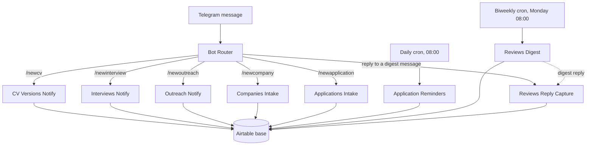

# JobOps

JobOps is a reference implementation of a job-search tracking system. It uses n8n workflows and an Airtable base to log companies, applications, interviews, CV versions, outreach drafts, and bi-weekly reviews, all through a Telegram bot. No part of the system uses an LLM API key.

This repository is the public, sanitised half of a two-track project. It contains fictional data only. No real company names, emails, or numbers appear anywhere in this repository.

## Why this exists

Most job-search trackers are a spreadsheet with free text in every cell. This project builds the same tracker as a small data platform instead. It uses linked records between tables and a config layer instead of hardcoded IDs. A bot collects structured input through dropdowns rather than a text box. It is a portfolio piece. It shows the same data-modelling and automation practices used on a production system, applied to a personal problem.

## Two-track architecture

The real version of this system runs against Elena's own Airtable base, with real companies, contacts, and application data. That base and its n8n credentials stay private and never appear here.

This repository is the second track: the same workflows and the same base structure, rebuilt against a fresh Airtable base seeded with three fictional companies. The workflows never contain a hardcoded base ID, table ID, or credential. Instead, every workflow reads its Airtable IDs from a small n8n Data Table at runtime (see [Self-hosting setup, Step 4](#step-4--set-up-the-config-data-tables) below). The exported JSON in this repository is safe to publish by construction, not because of manual redaction after the fact.

## Architecture

One Telegram bot, one router workflow, and eight sub-workflows called through n8n's Execute Sub-workflow node. A Telegram bot supports only one active webhook, so a single trigger fans out by command.

Two workflow patterns cover all nine workflows:

- **Notify-only** (CV Versions, Interviews, Outreach): the bot replies with a direct Airtable link. No fields are collected in the chat. You update the base by hand.
- **Q&A intake** (Companies, Applications): the bot opens a single multi-field form (n8n's `sendAndWait` node, custom form mode) with dropdowns pulled from the base's own select-field options. If you type a value that is not in the dropdown, the workflow adds it as a new option before it writes the record.

Application Reminders and Reviews Digest run on a schedule instead of a Telegram trigger. Reviews Reply Capture is the one workflow with an optional, undeployed extension point. A sticky note in the workflow shows where to add an AI Agent node. Add it if you want to interpret free-text replies with an LLM step later. This template ships without that node.

## The Airtable schema

Six tables. `seed/BASE_GUIDE.md` documents this in the base itself as a description field on each table.

| Table | Purpose |
|---|---|
| **Companies** | The warm-outreach target list. Companies worth approaching, not companies you already applied to. |
| **Applications** | Every job application you submitted, whether or not the company is also a Companies target. |
| **Interviews** | Interview rounds tied to one Application. Outcome is tracked separately from the Application's own Status, because an interview can advance while the application still shows "Interviewing." |
| **CV Versions** | Every CV or resume variant in circulation: template, language, target role category. |
| **Outreach** | Cold-mail and follow-up drafts. Every outbound message stops at Status = Proposed until a human reviews and sends it. |
| **Reviews** | Bi-weekly funnel stats: response rate, interview rate, a short narrative. |

**Applications** is the hub. It links to **Companies** only when the applied-to company is also a curated target, and to **CV Versions** for the resume variant used. **Interviews** links back to its Applications record. **Outreach** links to **Companies**. **Reviews** is a periodic snapshot: it summarises Applications and Interviews data but does not hold a live link to either.

Applications also keeps a free-text "Company name" and "CV version used" field, alongside the linked-record fields. This is deliberate. It is what the table looked like before the migration to linked records. It stays in place as a worked example of the "free text to linked records" pattern. See `seed/applications.csv` for the exact column layout, and `seed/*.csv` for one seeded example per table.

### Field reference

**Companies**: Name (primary) · Industry · Website · Location · Contact person · Contact email · LinkedIn · Notes · Possible role · Contact status (Not yet / E-Mail / LinkedIn / Website / Referral) · Last touch.

**Applications**: Position/Role (primary) · Company (link) · Company name (free text) · Role category (Data Engineer / Analytics Engineer / Context Engineer / Automation Builder / Data Product Manager) · Industry · Work location · Hours per week · Salary (k €) · Application link · Application date · Application deadline · Application via · CV version (link) · CV version used (free text) · Contact person · Status (draft / sent / wait for reply / interviewing / negotiating / offer / rejected / rejected myself / ghosted / maybe later) · Follow-up date (auto: Applied on + 10 days) · Notes · Feedback.

**Interviews**: Round (primary) · Application (link) · Contact person · Interview date · Follow-up date · Outcome (advanced / rejected / withdrew / pending) · Prep notes · Feedback.

**CV Versions**: Version name (primary — naming convention `template_LANG_semver`, for example `minimal_EN_1.0`) · Template · Role category · Language · Created · Updated · Changelog · Status.

**Outreach**: Subject (primary) · Company (link) · Type (cold mail / follow-up / reminder / thank-you) · Draft · Prompt version · Status (proposed / approved / drafted-in-mail / sent / answered / dead) · Proposed on · Sent on · Notes.

**Reviews**: Period (primary) · Apps sent · Responses · Interviews · Response rate · Interview rate · Best channel · Best CV version · Narrative · Generated on.

Every single-select field's options, colours, and emoji are a starting point. Rename or extend them for how you run your own search. The base only checks which field a value lives in, not what the value is called or coloured.

## Self-hosting setup

### Prerequisites

- An n8n instance. This template was built on n8n Cloud. Self-hosted n8n works the same way (D-13 in this project's decision log — Cloud was a personal choice, not a requirement).
- An Airtable account, free tier is enough.
- A Telegram bot token. Message [@BotFather](https://t.me/BotFather) on Telegram, run `/newbot`, and follow the prompts. You get a token back immediately.

### Step 1 — Build the Airtable base

Create a new Airtable base with the six tables from the [schema](#the-airtable-schema) above. Import each `seed/*.csv` file into its matching table to get three fictional example rows per table, plus the linked-record structure to copy.

### Step 2 — Connect the Telegram bot

Add a Telegram credential in your n8n instance using the bot token from BotFather. Message your new bot once, with any text. This step matters: without at least one message, n8n cannot show you the chat ID you need for Step 4.

### Step 3 — Import the workflows

Import all nine files from `workflows/` into your n8n instance, in this order: `00-router.json` first, then the rest in any order. Do not activate any workflow yet.

### Step 4 — Set up the config Data Tables

Every workflow reads its Airtable IDs from an n8n Data Table instead of a hardcoded value. n8n's native Variables feature sits behind a paid plan, so this template does not use it. You need two Data Tables.

**`jobops_template_config`** — one row, with a column for each of these seven values:

| Column | Value |
|---|---|
| `baseId` | Your Airtable base ID |
| `tableCompanies` | Companies table ID |
| `tableApplications` | Applications table ID |
| `tableInterviews` | Interviews table ID |
| `tableCvVersions` | CV Versions table ID |
| `tableOutreach` | Outreach table ID |
| `tableReviews` | Reviews table ID |

**`jobops_template_reviews_digests`** — no pre-filled rows needed. Two columns: `messageId` and `reviewsRecordId`. The Reviews Digest workflow writes a row here each time it sends a digest. Reviews Reply Capture uses that row to match a reply back to the correct Reviews record.

Every workflow that reads config ships with a sticky note titled "Setup required: jobops_template_config Data Table ID." Open each workflow and find that note. Open the **Load Config** node (or nodes, for Application Reminders, which has three) and point it at your new Data Table. Do the same for the two nodes that use `jobops_template_reviews_digests`, in **Reviews Digest** and **Reviews Reply Capture**.

### Step 5 — Set the Telegram chat ID

Two workflows run on a schedule and have no incoming Telegram message to read a chat ID from: **Application Reminders** and **Reviews Digest**. Both ship with a `YOUR_TELEGRAM_CHAT_ID` placeholder and a matching sticky note. The note explains how to find your chat ID: open the router's trigger node, use "Listen for test event," and send the bot a message.

Every other workflow reads the chat ID automatically from the incoming Telegram message, so you only need to do this for the two cron-triggered ones.

### Step 6 — Publish

After you fill in a placeholder, you must republish that workflow. Editing a workflow only changes its draft. It does not change what is live.

Once every workflow is published, message your bot with `/newcompany` or `/newapplication` to test the intake flow end to end.

## What each workflow does

| # | Workflow | Trigger | What it does |
|---|---|---|---|
| 1 | Bot Router | Telegram message | Reads the incoming command, and calls the matching sub-workflow. Also detects a reply to a Reviews digest message and routes it to Reviews Reply Capture. |
| 2 | CV Versions Notify | `/newcv` | Replies with a direct link to the CV Versions table. No fields are collected in the chat. |
| 3 | Interviews Notify | `/newinterview` | Replies with a direct link to the Interviews table. |
| 4 | Outreach Notify | `/newoutreach` | Replies with a direct link to the Outreach table. |
| 5 | Companies Intake | `/newcompany` | Opens a form with a field for each Companies column. Adds any new Industry or Location option to the table before it writes the record. |
| 6 | Applications Intake | `/newapplication` | Opens a form with a field for each Applications column. Sets Status to "Draft" automatically. Adds any new Industry, Work location, Application via, or Role category option before it writes the record. |
| 7 | Application Reminders | Daily cron, 08:00 | Three independent checks: a follow-up nudge 10 days after an application with Status = Sent gets no reply, an interview-prep nudge 48 hours before a scheduled interview, and a deadline nudge 3 days before an application deadline on a Draft application. |
| 8 | Reviews Digest | Biweekly cron, Monday 08:00 | Creates a new Reviews record, sends a Telegram message with a link to it, and stores the sent message's ID so a reply can be matched back to this record. |
| 9 | Reviews Reply Capture | Reply to a digest message | Looks up which Reviews record the reply belongs to, and appends the reply text to that record's Narrative field. |

## Seed data

`seed/*.csv` holds three fictional companies: GreenGrid Analytics GmbH, Datentopf UG, and Kumo Robotics K.K. All domains use `.example`, a domain reserved by RFC 2606 that never resolves to a real site. One application, one interview, three CV versions, two outreach drafts, and one review period round out the set. Extend it however you like. The workflows do not care how many rows exist, only which fields they contain.

## Recommended: observability with Logfire

This template does not wire an error workflow to an observability platform. The workflows run, and if a step fails, n8n's own execution log shows you why, but nothing pushes that failure anywhere else.

For a production version of this system, connect n8n's error workflow to [Logfire](https://logfire.pydantic.dev) (built on OpenTelemetry). At a high level:

1. Install the Logfire SDK in whatever service receives the webhook (`uv add logfire` for a Python receiver). You can also use Logfire's OTel-compatible HTTP endpoint directly from an n8n HTTP Request node.
2. Build a small n8n error workflow (**Settings → Error Workflow** on each workflow you want covered). Send the failed execution's ID, workflow name, and error message to that endpoint.
3. In Logfire, set up an alert on repeated failures within a short window. This stops a broken workflow from failing silently for two weeks before you notice the digest stopped arriving.

This is guidance, not a built feature. No live node in this template's workflows sends telemetry anywhere. If you build this wiring, treat it as an addition to the template, not a fix to something broken.

## Contributing

This is a personal reference implementation, published as a portfolio piece and a starting point for anyone who wants to run something similar. Fork it, strip what you do not need, and adapt the schema to your own job search. Issues and pull requests are welcome for bugs in the workflow logic or the base schema. Feature requests that move this away from a Telegram-and-Airtable-only, LLM-free design are out of scope. That constraint is intentional.

## License

MIT. See `LICENSE`.
